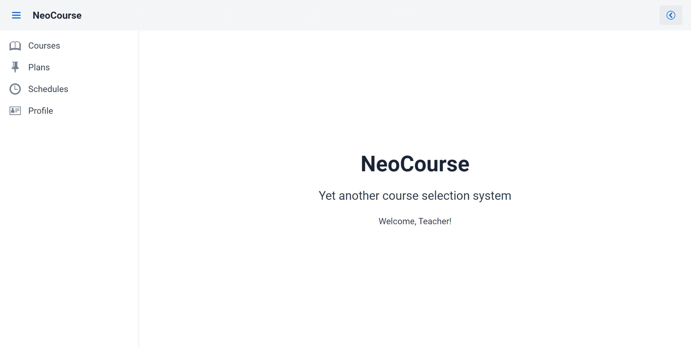

# NeoCourse

## Overview



NeoCourse is a course selection system implemented in Java, with the aim of offering students and teachers better UX.

Features:

- Course & plan management
- Course selection
- Evaluation

## Build

The executable requires that JDK 21 is installed.

Run the following command to build a production-ready artifact:

```bash
./gradlew # Or ./gradlew.bat on Windows
```

Run the following command to run all tests:

```bash
./gradlew check
```

## License

This project is licensed under the GNU General Public License version 3.

Copyright (C) 2024 Justin Chen (oosquare)